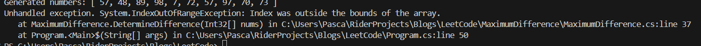
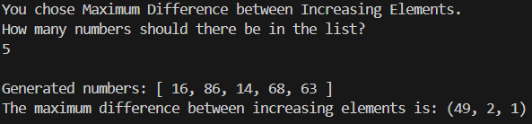
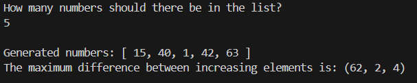
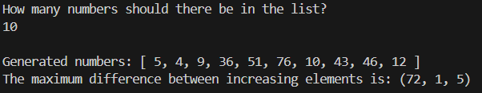
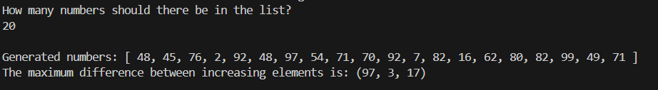
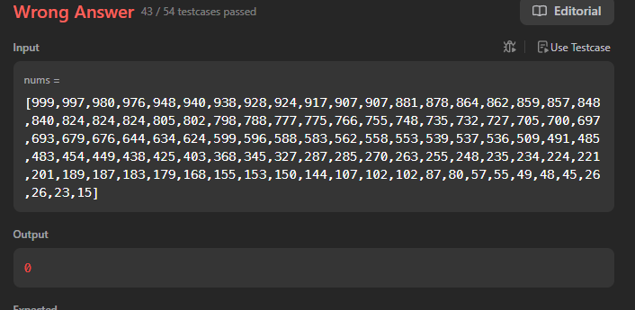
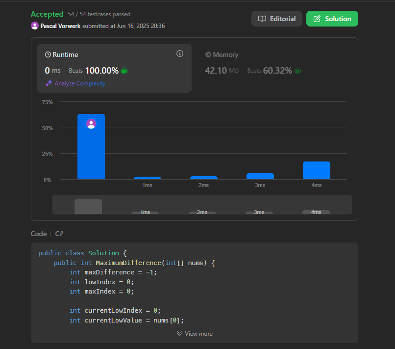

# LeetCode 2016: The Maximum Difference between Increasing elements

Date of writing: 16-06-2025

## First thoughts
This problem, in initial thought, seems pretty simple. We simply need to find the biggest difference between 2 numbers, if the latter of those 2 numbers is bigger then first number.

I believe we can do this in a O(n) solution, keeping track of some numbers whilst we go through the list!

The first pseudo code I can think of is as follows:

```pseudo
const maxDifference = -1;
const smallestIndex = 0;

for (int i = 0; i < numbers.length; i++){

    if i is equal to numbers.length - 1 :
        // We are at the end of the list, so we should only check numbers[i]

        if numbers[i] is larger then smallest:
            maxDifference is now numbers[i] - numbers[smallestIndex]

    // For each other situation, we can compare numbers[i] with numbers[i + 1]

    // First, let's check if the i + 1 is a smaller number, if so we can set that as the new smallestIndex and continue

    if numbers[i + 1] <= numbers[i] :
        smallestIndex = i + 1
        continue

    
    // Now, we can assume numbers[i + j] is larger then numbers[i], but we have to check if the difference is larger than what we previously had

    if (numbers[i + 1] - numbers[i]) > maxDifference:
        // We have found a new maxDifference!
        maxDifference = numbers[i + 1] - numbers[i]

        // The smallest index remains the same, as the next number might be even bigger! or smaller..
    }
```
---

## Implementation
The pseudo code is already pretty elaborate, but here is the first attempt at the complete c# function:

```csharp
public static (int, int, int) DetermineDifference(int[] nums)
    {
        if (nums.Length < 2)
        {
            return (-1, -1, -1); // Not enough elements to find a difference
        }

        int maxDifference = -1;
        int smallestIndex = 0;
        int largestIndex = 0;

        for (int i = 0; i < nums.Length; i++)
        {
            if (i == nums.Length)
            {
                // We are at the end of the list, so we should only check numbers[i]
                if (nums[i] > nums[smallestIndex])
                {
                    maxDifference = nums[i] - nums[smallestIndex];
                }
                continue;
            }

            // For each other situation, we can compare numbers[i] with numbers[i + 1]

            // First, let's check if the i + 1 is a smaller number, if so we can set that as the new smallestIndex and continue
            if (i + 1 < nums.Length && nums[i + 1] < nums[smallestIndex])
            {
                smallestIndex = i + 1;
                continue;
            }

            // Now, we can assume numbers[i + j] is larger then numbers[i], but we have to check if the difference is larger than what we previously had

            if (nums[i + 1] - nums[smallestIndex] > maxDifference)
            {
                maxDifference = nums[i + 1] - nums[smallestIndex];
                largestIndex = i + 1;
            }
        }


        return (maxDifference, smallestIndex, largestIndex);
    }
```
---

## Results of try number 1!
Okay, so the little console application we have will ask how large the list must be (although within the constraints) and generate a list with random numbers between 1 and 100. We will keep the number relatively low so we can actually make sure ourselves if the calculation is correct!

Also, to make it easier to determine where the indexes are, we return all 3 the numbers.



.. Oops.. We are clearly doing something wrong at the end of our for loop..


Okay! After some debugging we found that the issue was we are still getting to the last index, I made a mistake with the nums.Length, thinking this would be 0 based, but ofcourse it is not. So with a simple fix we have now solved that bug:

```csharp
if (i + 1 == nums.Length){ // Or nums.Length - 1
    if (nums[i] > nums[smallestIndex]){
        maxDifference = nums[i] - nums[smallestIndex];
    }
    continue;
}
```
---

## Try number 2
Let's see what we get now when we run our program:



Nope.. we are still doing something wrong. Clearly, the maximum difference should have been 86 - 16 = 70, but somehow the values after it still got there.

Let's rethink some things:

- First of all, we don't really need to iterate over the first element, as we can simply record that value and assume that will be the lowest.
- Right now, we are iterating and comparing one step ahead, but instead of that, we can keep track of the smallest index and compare with the current index.
- The smallest index in the array might not be the actual smallest index we need for our 'largest' difference! For example: [5, 10, 4, 6, 7]. 

This might actually make our algorithm a lot easier aswell.. Let's try to write some pseudocode first again:

```
int maxDifference = -1;
int lowIndex = 0; // This is the final low index we used
int maxIndex = 0; // This is the final max index we used

int currentLowIndex = 0;
int currentLowValue = nums[0] // To make it easier to reference later..

for (int i = 1; i < nums.Length; i++){
    // If nums[i] - currentLowValue is larger then maxDifference, we have a new maxDifference!
    if nums[i] - currentLowValue > maxDifference:
        maxDifference = nums[i] - currentLowValue;
        lowIndex = currentLowIndex // Keep track of the current Low index we used for this max index!
        largestIndex = i;

    // Additionally we need to check if the current index is at all lower then our current lowest value
    if nums[i] is lower then currentLowValue:
        currentLowValue = nums[i]
        currentLowIndex = i // Keep track of the currently used minimum index aswell!

}
```

---

Let's try to write this up in a function

```csharp
 public static (int, int, int) DetermineDifference2(int[] nums)
    {
        if (nums.Length < 2)
        {
            return (-1, -1, -1); // Not enough elements to find a difference
        }

        int maxDifference = -1;
        int lowIndex = 0;
        int maxIndex = 0;

        int currentLowIndex = 0;
        int currentLowValue = nums[0];

        for (int i = 1; i < nums.Length; i++)
        {
            // If nums[i] - currentLowValue is larger then maxDifference, we have a new maxDifference!
            if (nums[i] - currentLowValue > maxDifference)
            {
                maxDifference = nums[i] - currentLowValue;
                lowIndex = currentLowIndex; // Keep track of the current Low index
                maxIndex = i;
            }

            
            // Additionally we need to check if the current index is at all lower then our current lowest value
            if (nums[i] < currentLowValue)
            {
                currentLowValue = nums[i];
                currentLowIndex = i; // Keep track of the currently used minimum index aswell!
            }
        }

        return (maxDifference, lowIndex, maxIndex);
    }
```
--- 

## Try number 3!
We hooked this method up to our console application and let's see the result!



This seems correct! Indeed, the largest difference is between '1' and '63', the value of 62!

Let's try 2 more with larger lists..



Now this one also still seems to work, indeed the largest difference i can spot with my human eyes is between 4 and 76, index 1 and 5.

A final one! Then we will submit this solution to Leetcode if it passes!



Indeed, again, the largest difference seems to be between the number 2 and 99, on index 3 and 17!

## Results on LeetCode, was our algorithm fast or slow?



Darn! Still no correct solution! It seems like we missed some edge cases, which ofcourse makes sense as we only used random numbers.. Hitting those edge cases would be pretty hard. Maybe we should have done some TDD?

It seems like we missed the edge case where the difference might be 0 between 2 items, but the algorithm expects to still output -1, not 0.. Let's fix this in our code:

```csharp
int currentDiff = nums[i] - currentLowValue;

if (currentDiff > maxDifference && currentDiff > 0)
{
    maxDifference = nums[i] - currentLowValue;
    lowIndex = currentLowIndex;
    maxIndex = i;
}
```

Okay... Let's try again!



## Final thoughts
Even though this is marked as 'easy' on Leetcode, we still had some trouble making sure our algorithm worked and no edge cases made it past the tests! Does that make me a bad programmer? I am not sure, what do you think, but I won't let it keep me down! On to the next LeetCode problem! 

I encourage you to also try these problems, they help a lot with problem solving skills, which is helpful for any programmer, not only people that are hunting jobs at the biggest and best companies!

Don't fall into the trap of using AI to solve the problems.. you won't learn nearly as much from it!

The code for all this can be found here: 
